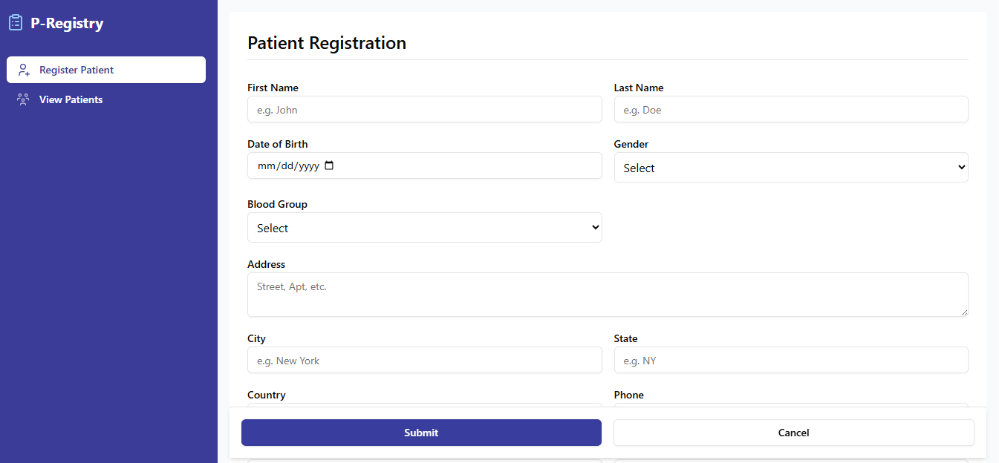
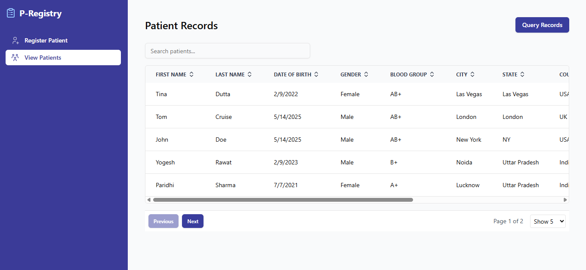
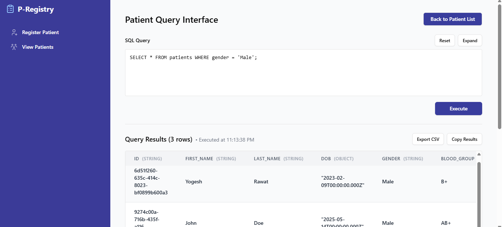
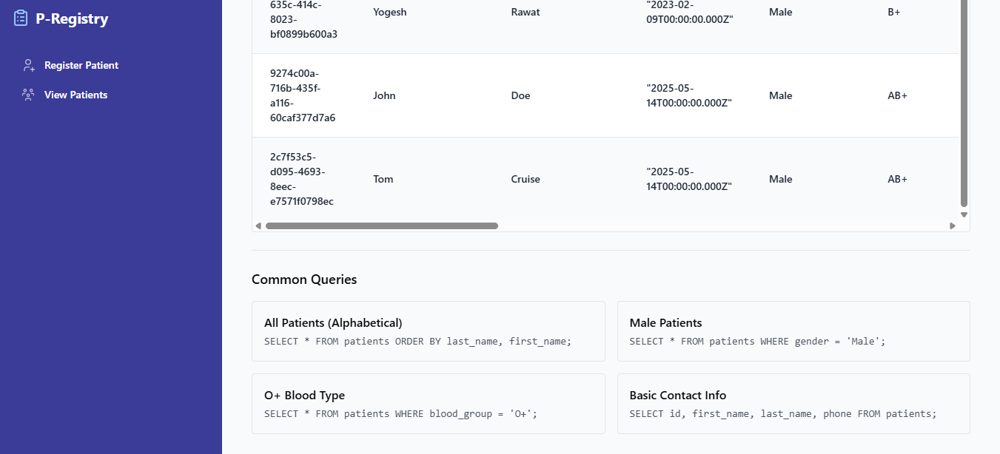

# 🏥 P-Registry


A modern patient records management system with offline capabilities, built with React, TypeScript, and PGlite (PostgreSQL in-browser).

Checkout the live application at : https://p-registry.vercel.app/

## ✨ Features

### Patient Management

**Patient Registration**: Comprehensive form with validation  
**Patient Records**: View, sort, and filter patient data  
**Advanced Query**: SQL interface for complex data exploration  
**Real-time Sync**: BroadcastChannel-based data synchronization

### Technical Highlights

💡 **In-browser Database**: PGlite (PostgreSQL-compatible)  
📱 **Offline-First**: Works without internet connection  
🎨 **Modern UI**: Built with shadcn/ui components  
🔒 **Type Safety**: Full TypeScript integration

## 🚀 Getting Started

### Prerequisites

Node.js (v18+ recommended)
npm or yarn

### Installation

1. Clone the repository

```bash
git clone https://github.com/Niharika-26/p-registry.git
cd p-registry
```
2. Install dependencies

```bash
npm install
```

3. Start the development server

```bash
npm run dev
```

4. Open in browser

   http://localhost:5173

## Challenges Faced

**Tab Synchronization**  
While implementing the tab sync feature, I faced challenges getting it to work properly. After going through the PGlite documentation, I learned about the multi-tab worker feature and used it to implement the solution.

**IndexedDB Setup**  
Creating IndexedDB was challenging due to ambiguous errors during development. Through debugging, I discovered that specific Vite configurations were needed for PGlite's IndexedDB to work correctly.

**Build Optimization**  
During deployment, we encountered bundling conflicts between Vite's default worker format (iife) and our code-splitting setup. This necessitated manual configuration of worker settings in vite.config.ts to ensure proper compilation.


## 📚 Tech Stack

| Technology     | Purpose                  |
| -------------- | ------------------------ |
| React 18       | Frontend framework       |
| TypeScript     | Type safety              |
| PGlite         | In-browser PostgreSQL    |
| shadcn/ui      | UI components            |
| React Router   | Navigation               |
| Formik + Yup   | Form handling/validation |
| TanStack Table | Data tables              |

## 📋 Available Scripts

```bash
npm run dev # Start development server  
npm run build # Create production build  
npm run preview # Preview production build  
npm run lint # Run ESLint  
npm run format # Format code with Prettier
```

## 📸 Screenshots

**Patient Form**  


**Patient List**  


**Query Interface**


